<!-- Animated Header Banner -->

<!-- Dynamic Typing Effect -->

 
<!-- Professional Badges Row -->

  
  
  
  

<!-- Social Connect Badges -->

  
  
  

<!-- About Me Section with Side Image -->
<h2 align="center">
  
  About Me
</h2>
<table>
  <tr>
    <td width="60%">
      

        I'm a <strong>Full Stack Software Engineer</strong> and <strong>BS Computer Science student</strong> from Pakistan, passionate about architecting scalable, maintainable, and user-centric applications that solve real-world problems.
      

      

        With expertise spanning <strong>React, React Native, Node.js, Express.js, PostgreSQL, and MongoDB</strong>, I specialize in building end-to-end solutions — from designing clean system architectures and RESTful APIs to crafting pixel-perfect, responsive user interfaces.
      

      

        Currently diving deep into <strong>Artificial Intelligence</strong> — exploring <strong>LangChain, RAG pipelines, LLMs, AI Agents, and Computer Vision</strong> — to build the next generation of intelligent applications.
      

      

        <strong>Philosophy:</strong> <em>Transform complex problems into elegant software solutions. Build. Learn. Improve. Repeat.</em>
      

    </td>
    <!-- <td width="40%" align="center">
      
    </td>
  </tr> -->
</table>
<!-- Quick Stats / Facts -->
<h2 align="center">⚡ Quick Facts</h2>

  <table>
    <tr>
      <td align="center"><strong>🎓</strong> BS Computer Science</td>
      <td align="center"><strong>💻</strong> 3+ Years Coding</td>
      <td align="center"><strong>🚀</strong> 10+ Projects Built</td>
      <td align="center"><strong>🤖</strong> AI & ML Enthusiast</td>
    </tr>
    <tr>
      <td align="center"><strong>🌐</strong> Full Stack Developer</td>
      <td align="center"><strong>📱</strong> React Native Dev</td>
      <td align="center"><strong>☁️</strong> Cloud & DevOps</td>
      <td align="center"><strong>📚</strong> Lifelong Learner</td>
    </tr>
  </table>

<!-- Tech Stack Section -->
<h2 align="center">🛠 Tech Stack & Tools</h2>
<h3 align="center">Frontend Development</h3>

  

<h3 align="center">Backend Development</h3>

  

<h3 align="center">Mobile Development</h3>

  
  

<h3 align="center">AI / Machine Learning</h3>

  
  
  

<h3 align="center">DevOps & Tools</h3>

  

<!-- Featured Projects Section -->
<h2 align="center">⭐ Featured Projects</h2>
<table>
  <tr>
    <td width="50%">
      <h3 align="center">🤖 AI Document Q&A Assistant</h3>
      

        
        
        
        
        
      

      

        An <strong>AI-powered document intelligence platform</strong> enabling natural language interaction with uploaded documents. Features a modular RAG pipeline using <strong>LangChain, local LLMs, and vector databases</strong> for semantic search and contextual Q&A.
      

      

        
      

    </td>
    <td width="50%">
      <h3 align="center">🛒 ProShop – MERN E-Commerce</h3>
      

        
        
        
        
        
      

      

        A <strong>full-stack e-commerce platform</strong> with secure authentication, role-based access, product management, shopping cart, order workflows, payment integration, and admin dashboards. Built with scalable RESTful APIs and responsive UI.
      

      

        
      

    </td>
  </tr>
  <tr>
    <td width="50%">
      <h3 align="center">🍽 PostgreDine – Restaurant Manager</h3>
      

        
        
        
        
      

      

        A <strong>PERN stack restaurant management system</strong> with relational database design, menu management, customer data handling, and operational workflows. Focused on clean architecture and scalable backend patterns.
      

      

        
      

    </td>
    <td width="50%">
      <h3 align="center">📱 MealsToGo – React Native App</h3>
      

        
        
        
        
      

      

        A <strong>cross-platform mobile application</strong> for restaurant discovery with authentication, search, navigation, favorites, and mobile-first responsive UI. Built with reusable components and modern React Native practices.
      

      

        
      

    </td>
  </tr>
  <tr>
    <td colspan="2" align="center">
      <h3 align="center">🤖 LangChain Chat – AI Conversational App</h3>
      

        
        
        
        
        
        
      

      

        An <strong>AI-powered conversational application</strong> with prompt engineering, conversation memory, and modular AI workflows for contextual multi-turn conversations.
      

      

        
      

    </td>
  </tr>
</table>
<!-- GitHub Analytics Section -->
<h2 align="center">📊 GitHub Analytics</h2>
<!-- 

  

  -->

  <!--  -->
  

 

  

<!-- Certifications Section -->
<h2 align="center">🏆 Certifications & Credentials</h2>

  <table>
    <tr>
      <td align="center" width="33%">
        
         
        <strong>Front-End Developer</strong>
         
        Professional Certificate
      </td>
      <td align="center" width="33%">
        
         
        <strong>Node.js & MongoDB Developer</strong>
         
        Professional Certificate
      </td>
      <td align="center" width="33%">
        
         
        <strong>MERN Stack Development</strong>
         
        Specialization
      </td>
    </tr>
  </table>

<!-- Currently Exploring Section -->
<h2 align="center">🌱 Currently Exploring</h2>

  

    
    
    
    
    
    
    
    
  

<!-- Connect Section -->
<h2 align="center">🤝 Let's Connect & Collaborate</h2>

  

    I'm always open to discussing <strong>new projects, creative ideas, or opportunities</strong> to be part of your vision. Whether it's a full-stack application, a mobile app, or an AI-powered solution — let's build something amazing together.
  

  

    
    
    
  

<!-- Snake Contribution Graph -->

  <picture>
    <source media="(prefers-color-scheme: dark)" srcset="https://raw.githubusercontent.com/Shariif-Mohsoo/Shariif-Mohsoo/output/github-contribution-grid-snake-dark.svg" />
    <source media="(prefers-color-scheme: light)" srcset="https://raw.githubusercontent.com/Shariif-Mohsoo/Shariif-Mohsoo/output/github-contribution-grid-snake.svg" />
    
  </picture>

<!-- Footer -->

  
  <h3>💡 Build • Learn • Improve • Repeat</h3>
  

    ⭐ If you find my projects interesting, consider giving them a star! It means a lot.
  

  

    Made with ❤️ by <strong>Muhammad Mohsin</strong>
  

